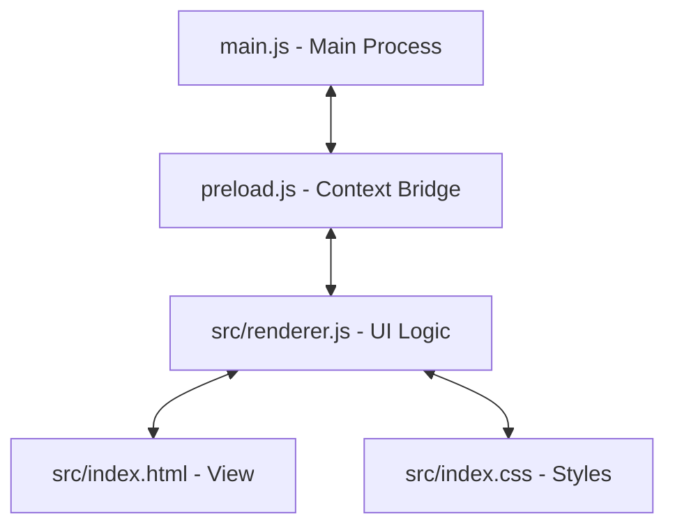

# Authenticator Client - Agent Development Guide

Welcome, Agent! This guide explains the architecture, design patterns, and instructions for continuing the development of the **Authenticator Client** application.

---

## 🏗️ Architecture Overview

The app is built on **Electron** with a clear separation between the main process, preload bridge, and renderer UI:



- **`main.js`**: Handles window creation, native window options, default browser navigation for external links, and local file read/write operations (database).
- **`preload.js`**: A secure context bridge exposing limited IPC APIs (`getAccounts`, `saveAccounts`, `generateQRCode`, `copyToClipboard`) to the renderer process without exposing full Node APIs.
- **`src/`**: Contains the frontend assets.
  - **`index.html`**: The UI skeleton, modal views, and dependency scripts (`otpauth` and `jsQR`).
  - **`index.css`**: Styling rules, variables, glassmorphic layout, circular timer calculations, and scanner loop animations.
  - **`renderer.js`**: The core business logic, including TOTP code calculation, drag-to-reorder events, camera streams, image decoding, and migration payload marshalling.

---

## 💾 Database & State Management

- **Storage Path**: Accounts are saved in a flat JSON file at:
  `C:\Users\<Username>\AppData\Roaming\authenticator-desktop\accounts.json`
- **Schema**:
  ```json
  [
    {
      "id": "acc_1723871239_abc123",
      "issuer": "Google",
      "name": "user@gmail.com",
      "secret": "JBSWY3DPEHPK3PXP"
    }
  ]
  ```
- **Updates**: Anytime accounts are added, edited, deleted, or reordered, `window.api.saveAccounts(accounts)` is called to sync the array to disk immediately.

---

## 🔄 Drag-to-Reorder Card List

- **Implementation**: Uses native HTML5 Drag and Drop events (`dragstart`, `dragend`, `dragover`, `drop`) on each `.account-card` element.
- **Visuals**: A card being dragged gets the `.dragging` class, which triggers a semi-transparent scaled-down state with a cyan dashed border.
- **Ordering Sync**: When dropped, the renderer maps the current DOM node order back into a reordered `accounts` array, saves it to disk, and refreshes the UI.

---

## 📲 Google Authenticator Migration (Protobuf)

Authenticator Client decodes and encodes Google Authenticator migration payloads:
- **Format**: `otpauth-migration://offline?data=<Base64 Protobuf>`
- **Decoder**: Reads the serialized Protobuf varints and fields, extracts name, issuer, and secret, and converts the binary secret into a standard Base32 string.
- **Encoder**: Converts the Base32 secrets back to binary bytes, builds the sub-messages (`OtpParameters`) and parent message (`MigrationPayload`) using custom varint writing helpers, base64 encodes it, and outputs a valid migration URL.

---

## 🧪 Testing

Unit tests are written using Node's native test runner (`node:test`) and assert module (`node:assert`).
- **Run Tests**:
  ```bash
  npm test
  ```
- **Configuration**: Tests are located in [test/logic.test.js](file:///c:/Users/fawcet.makay/Projects/ApplicationProjects/authenticator/test/logic.test.js). Since `renderer.js` contains browser-specific functions, the test runner mocks browser globals (`window`, `document`, `TextEncoder`, `TextDecoder`) before importing it.

---

## 🚀 Building & Packaging

- **Mode Check**: In `main.js`, we inspect `app.isPackaged` to determine if we are in dev or prod mode. DevTools will only open automatically during development (`npm start`).
- **Create Standalone Portable Binary**:
  ```bash
  npm run build
  ```
  The compiler (`electron-builder`) compiles the project and outputs a portable `.exe` in `dist/`.

---

## 💡 Quick Tips for Future Development
- Keep external library imports out of `preload.js` to prevent sandbox errors; instead, include them via script tags in `index.html` or bundle them in `src/`.
- Ensure all new features retain the **dark glassmorphic cyber cyan theme**.
