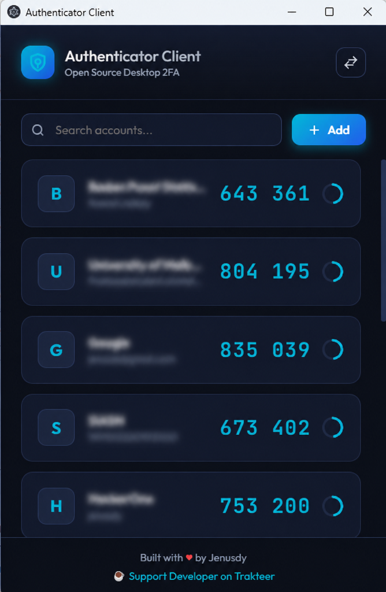

# Authenticator Client
> Open Source Desktop 2FA

Authenticator Client is a opensource, secure, and modern offline desktop application for managing Two-Factor Authentication (2FA) tokens (TOTP). Built on Electron with a glassmorphic cyber-themed user interface, it provides a safe desktop alternative to mobile authenticator apps, ensuring your credentials stay 100% offline and under your control.

<p align="center">
  
</p>

---

## 🌟 Key Features

- **Futuristic Glassmorphism UI**: High-contrast cyber cyan styling utilizing premium typography (Outfit & JetBrains Mono) with fluid animations.
- **100% Offline & Private**: Credentials are saved fully locally in your user profile path; no external cloud synchronizations or analytics.
- **Dynamic Reordering**: Simply drag and drop account cards in the dashboard to rearrange your codes dynamically.
- **Multiple Import Modes**:
  1. **Webcam Scan**: Point your device's camera at a 2FA QR code to import accounts instantly.
  2. **Image Upload**: Upload a screenshot/image containing a QR code.
  3. **Manual Entry**: Manually type in Platform Issuer, Username, and Secret Key (with active base32 validation).
- **Fast Device Migration (Google Authenticator Compatible)**:
  - Generates standard `otpauth-migration://offline?data=...` QR codes.
  - Allows you to easily export your database to another device or back up your keys as an image file.

---

## 🛠️ Tech Stack

- **Core**: Electron, HTML5, Vanilla JavaScript
- **Styling**: Vanilla CSS (Custom properties, grid layouts, keyframe laser and progress animations)
- **Dependencies**:
  - `otpauth`: Safe local TOTP code calculations.
  - `jsqr`: Zero-dependency QR Code scanner library.
  - `qrcode`: Dynamic backend QR Code generation.

---

## 🚀 Getting Started

### Prerequisites

You need **Node.js** (v16 or higher) installed on your system.

### Installation

1. Clone the repository or open the project folder.
2. Install the node packages:
   ```bash
   npm install
   ```

### Running Locally (Development)

Start the Electron dev client:
```bash
npm start
```

### Packaging for Release

Generate a standalone portable executable (`.exe` for Windows) that runs without installation:
```bash
npm run build
```
The output file will be saved inside the `dist/` directory.

---

## 🔒 Data Location

All codes are stored securely on your local machine at:
- **Windows**: `C:\Users\<Username>\AppData\Roaming\authenticator-desktop\accounts.json`

---

## 📄 License

This project is licensed under the [ISC License](LICENSE).

---

## ☕ Support Developer

If you find this application helpful, consider supporting the developer:
- **Trakteer**: [Support Jenusdy on Trakteer](https://trakteer.id/jenusdy/tip)

---

<p align="center">
  Built with ❤️ by <b>Jenusdy</b>
</p>
